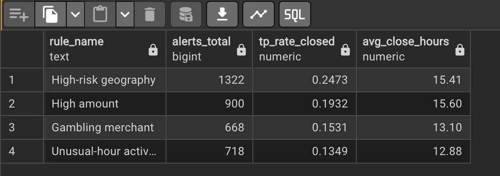
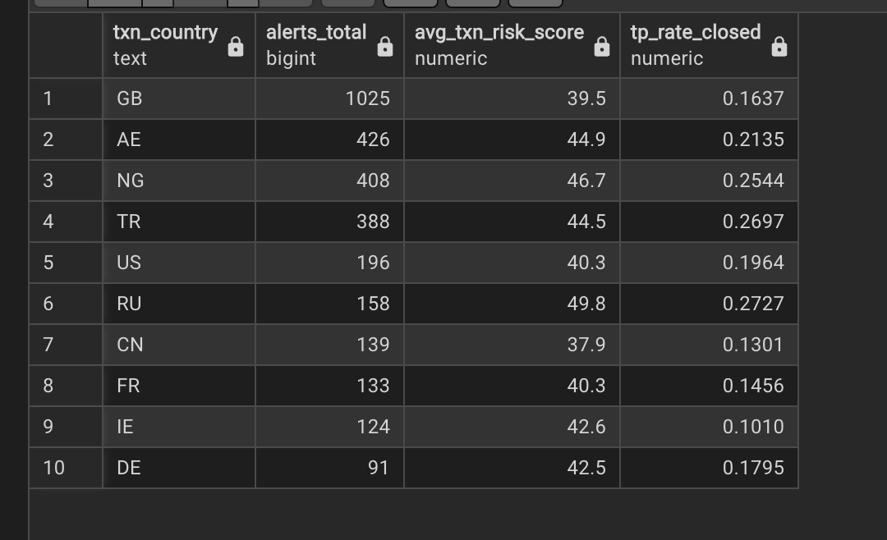
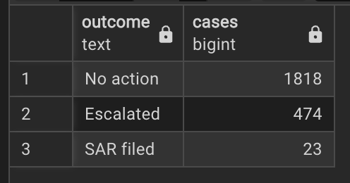
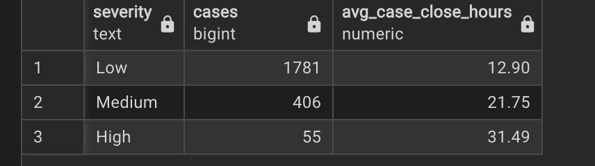

Project Case Study
Project Title
Transaction Monitoring Analytics (PostgreSQL): Alerts → Cases → Outcomes
Problem
Transaction monitoring produces high volumes of alerts, but investigation teams need to understand:
which rules generate the most workload,
which rules/geographies have the highest “signal” (true positives),
how investigation time (SLA) changes with severity,
and how alerts should be grouped into cases to reflect real investigations.
In the raw dataset, most alerts had no reliable case_id, making case-level analysis incomplete. The challenge was to build a realistic case workflow and deliver meaningful KPIs.
Approach (End-to-End)
1) Database setup & modelling
Installed PostgreSQL + pgAdmin on Mac
Created a relational schema with tables: customers, merchants, analysts, transactions, alerts, cases
Loaded CSV data into PostgreSQL and validated row counts and keys
2) Data engineering & troubleshooting (real-world issues)
During ingestion, I resolved several common pipeline issues:
CSV header being imported as data (e.g., "alert_id" into integer columns)
Integer IDs converted into floats (e.g., 52.0, 1.0)
Column-order mismatch causing data to shift into wrong fields
These were fixed through import settings, cleaning, and explicit column mapping.
3) Case workflow creation (core modelling decision)
Because ~94% of alerts had case_id = NULL, I implemented a realistic case definition:
Rolling 30-day case assignment: for each customer, consecutive alerts are grouped into the same case unless the gap between alerts exceeds 30 days.
This converted alert-level events into investigation-level units (cases), enabling SLA and outcome analysis.
4) KPI layer via SQL Views
Created reusable reporting views:
v_rule_performance (alert volume, TP rate, avg close hours by rule)
v_geo_hotspots (alert volume, avg risk score, TP rate by country)
v_analyst_productivity (volume closed, avg close hours, TP rate by analyst/team)
v_alerts_daily and v_funnel_daily (daily operational funnel)
Tools & Skills Demonstrated
PostgreSQL / SQL: joins, aggregation, window functions, CTEs, views
Data pipeline debugging: schema alignment, type cleaning, import correctness
Financial Crime analytics thinking: rule tuning, triage funnels, SLA management, risk-based prioritisation
Dataset Snapshot (Final)
Transactions: 60,000
Alerts: 3,674
Cases (rolling 30-day): 2,315
Avg alerts per case: 1.59 (max 15)
Key Findings (Results)
1) Monitoring funnel (case outcomes)
No action: 1818
Escalated: 474
SAR filed: 23
This matches a realistic TM funnel: high volume → smaller escalation → very low SAR rate.
2) SLA increases with severity
Average case close time rises with severity:
Low: 12.90h
Medium: 21.75h
High: 31.49h
Higher-severity investigations are more complex and capacity-intensive.
3) Rule performance (signal vs noise)
High-risk geography: 1322 alerts, TP ~24.7% (best signal + biggest workload driver)
High amount: 900 alerts, TP ~19.3%
Unusual-hour activity: 718 alerts, TP ~13.5% (noisiest among major rules)
Workload is concentrated in a few rules—ideal for targeted optimisation.
4) Geo hotspots (volume ≠ risk)
Top alert volume includes GB (1025), AE (426), NG (408), TR (388).
Higher TP rates appear in RU/TR/NG/AE (~25–27%), showing that the largest-volume geography is not always the highest-signal.
Recommendations (What I would do in a real team)
Prioritise high-signal rules/geos (e.g., High-risk geography; RU/TR/NG/AE) for faster triage and escalation.
Tune noisy rules (e.g., Unusual-hour activity) using segmentation (customer risk, PEP flag, channel, amount thresholds) to reduce false positives.
Capacity planning: protect SLA by allocating more analyst time to Medium/High severity queues due to longer close times.

## Repository Structure
- `sql/01_schema.sql` — PostgreSQL table schema (DDL)
- `sql/02_case_assignment_rolling_30d.sql` — rolling 30-day case assignment + rebuild cases
- `sql/03_views.sql` — KPI views (rule performance, geo hotspots, analyst productivity, funnel)
- `sql/04_example_queries.sql` — example queries used for analysis
- `screenshots/` — screenshots of outputs used in findings

## Screenshots

